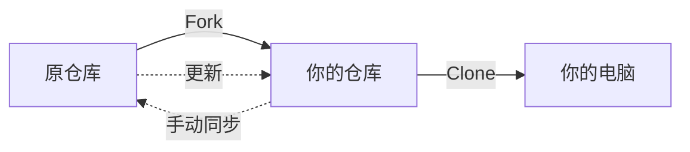
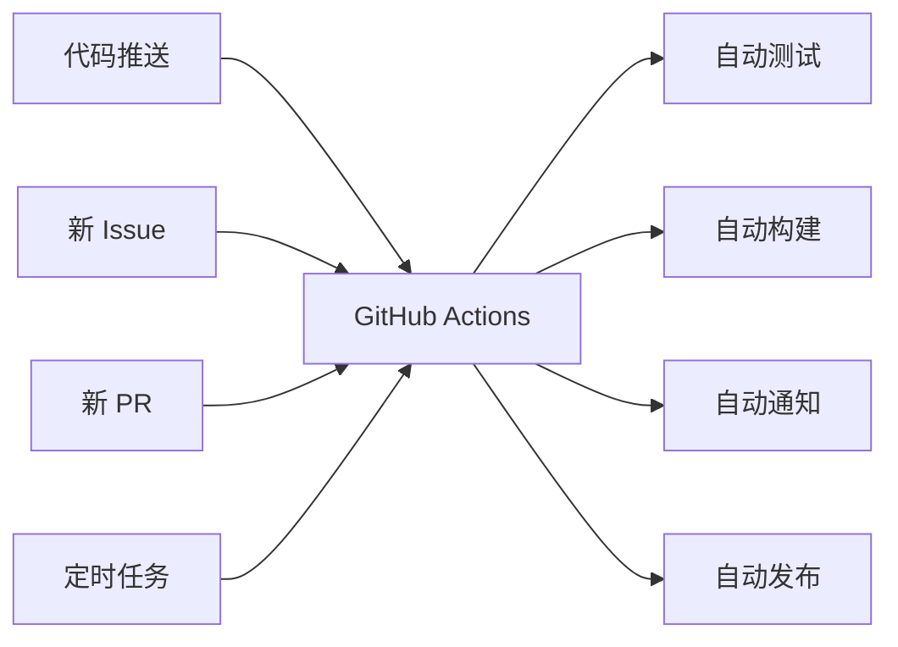

> [!NOTE]
> 这篇文章可能会让你不舒服。
> 
> 因为看完之后，你可能会发现自己——**从来没用对过 GitHub**。

---

## 一个扎心的问题

你点过多少次 Star？

几百次？上千次？

然后呢？那些 Star 过的仓库，你后来回去看过几次？

> [!IMPORTANT]
> **残酷的真相**：Star 不是你的收藏夹，是你的「已读」标记。
> 
> GitHub 官方从来没说过 Star 是收藏功能。它只是一个书签，但没有任何智能分类、没有标签、没有搜索——你存一千个仓库试试，能找到想要的那个吗？

我猜你和我一样：**点了Star，然后永远忘了它。**

---

## 你会 Fork 吗？

Fork 按钮谁都会点。

但你知道 Fork 和 Clone 的区别吗？你知道 Fork 出来的仓库，原仓库更新了要怎么同步吗？



[!WARNING]
大多数人都卡在这一步：Fork 之后，原仓库更新了，你的 Fork 还是老的。

解决方案？不是点按钮就能解决的。你需要：

1. 在本地添加原仓库为 upstream
2. git fetch upstream
3. git merge upstream/main
4. git push origin main

或者用 GitHub 网页端那个又小又不起眼的「Sync fork」按钮。

你觉得 GitHub 把这个功能做明显了吗？

没有。

它就不想你轻松同步。

---

Pull Request 的水有多深

你以为 PR 就是「点个按钮请求合并」？

[!NOTE]
这只是表面上的1%。

PR 可以：

· 只合并部分 commit，不合并全部（cherry-pick）
· 修改别人的 PR（需要原分支开放权限）
· 不合并代码，只用来讨论问题
· 用 [WIP] 前缀标记还没写完的 PR（Work In Process）
· 用 Draft PR 模式，等写完了再请求 Review

```yaml
---
title: 你真的弄懂了GitHub？
published: 2026-05-18
description: 用了这么多年，才发现自己只是会点按钮而已。
tags: [GitHub, Git, 教程]
category: 技术
draft: false
---

我见过有人在 PR 里放了 127 个文件改动，然后问「谁能帮我 review 一下」。

127 个文件。你觉得有人会看吗？

> [!CAUTION]
> **PR 越小，越容易合并。** 这是 GitHub 协作的第一铁律，但几乎没人遵守。

---

## Issue 不是让你发牢骚的

很多人把 Issue 当论坛用：

- 「怎么安装？」
- 「能不能加个功能？」
- 「这烂东西不能用！」

> [!TIP]
> Issue 的设计目标是：**可追踪的问题记录**。
> 
> 一个好的 Issue 应该包含：
> - 复现步骤
> - 预期行为 vs 实际行为
> - 环境信息（OS、版本号）
> - 日志/截图

```markdown
## 复现步骤
1. 执行 `nebula start`
2. 等待 3 秒
3. 观察到崩溃

## 预期行为
正常启动

## 实际行为
```

Traceback (most recent call last):
File "main.py", line 42, in <module>
start()
TypeError: start() missing 1 required argument

```

## 环境
- OS: Ubuntu 22.04
- Python: 3.10.12
- NebulaShell: v1.2.0
```

[!IMPORTANT]
按照这个模板写的 Issue，维护者会更愿意回复。

只写「不 work」的 Issue，会被直接关掉。

---

GitHub Actions 到底是啥

大多数人以为 Actions 是「CI/CD 工具」。

对，但不全对。

[!NOTE]
Actions 其实是 GitHub 的自动化操作系统。

你可以用它做什么？

场景 触发条件 执行动作
自动测试 每次 push 跑 pytest
自动发布 打 tag 打包上传
自动提醒 新 Issue 发钉钉/飞书
自动更新文档 PR 合并 重新生成 API 文档
自动关停旧 Issue 30 天无活动 添加 stale 标签



[!TIP]
一个 .github/workflows/deploy.yml 文件，就能让 GitHub 帮你干所有自动化的事情。

大多数项目——根本没有用「对」。

---

GitHub 不只是代码托管

很多人只用了 GitHub 的 10%：

· 点 Star（然后忘掉）
· Fork 仓库（然后从不同步）
· Clone 下来（然后再也不管）

[!NOTE]
GitHub 还有这些功能，你可能没用过：

GitHub Pages

免费托管静态网站。你的个人博客、项目文档，都可以直接 push 到 gh-pages 分支就上线。域名可以是 你的用户名.github.io。

GitHub Discussions

论坛式的新功能。比 Issue 更适合「讨论」而不是「报告问题」。可以作为项目的 Q&A 区、公告板、想法收集池。

GitHub Projects

看板式项目管理，类似 Trello。可以管理 Issue、跟踪进度、分配任务。

GitHub Wiki

每个仓库自带一个 Wiki，可以用来写文档。虽然是独立的仓库，但很多人不知道这个功能。

GitHub Gists

代码片段分享。贴一段代码，生成一个独立 URL。可以嵌入别人网页，可以 fork 别人的 Gist。

GitHub CLI

命令行工具。在终端里 gh pr create、gh issue list、gh repo clone。不用再打开网页。

---

你真的弄懂了 GitHub 吗？

回到一开始的问题。

[!NOTE]
你第一次注册 GitHub，是为了什么？

存代码？找开源项目？跟别人合作？

你用对了吗？

[!TIP]
我猜你和我一样：

· Star 了几百个仓库 → 再也找不到
· Fork 了十几个仓库 → 从来不同步
· 提过几个 Issue → 没有回音
· 发起过 PR → 不知道怎么推进
· 听说过 Actions → 没配置过

这不丢人。大部分人都是这样。

[!IMPORTANT]
区别在于——有些人意识到了，开始学。

有些人没意识到，继续当一个「点按钮的人」。

---

下一步做什么

如果你真的想弄懂 GitHub：

1. 学习 Git 而不是 GitHub。Git 是底层，GitHub 是上层。不懂 Git 的人永远玩不明白 GitHub。
2. 自己 Fork 一个仓库，然后保持同步。把这个流程跑通。
3. 给别人提一个真正有用的 PR。修一个 bug、改一个 typo、加一个测试——越小的 PR 越容易被合并。
4. 配置一个 GitHub Actions。让某个 repo 在 push 时自动跑点什么。
5. 用 GitHub Issues 提交一个规范的问题报告。按照模板写，看看维护者会不会回复。

```bash
# 先从这里开始
git --version
gh --version
```

如果看到版本号，你已经超过 90% 的用户了。

---

这篇文章写到这里，其实我也只用了 GitHub 可能 40% 的功能。

剩下的 60%，我还在学。

如果你知道什么我不知道的，欢迎告诉我。