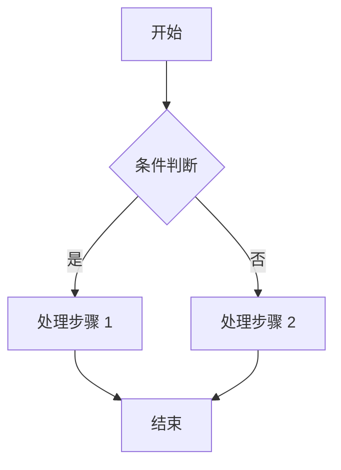
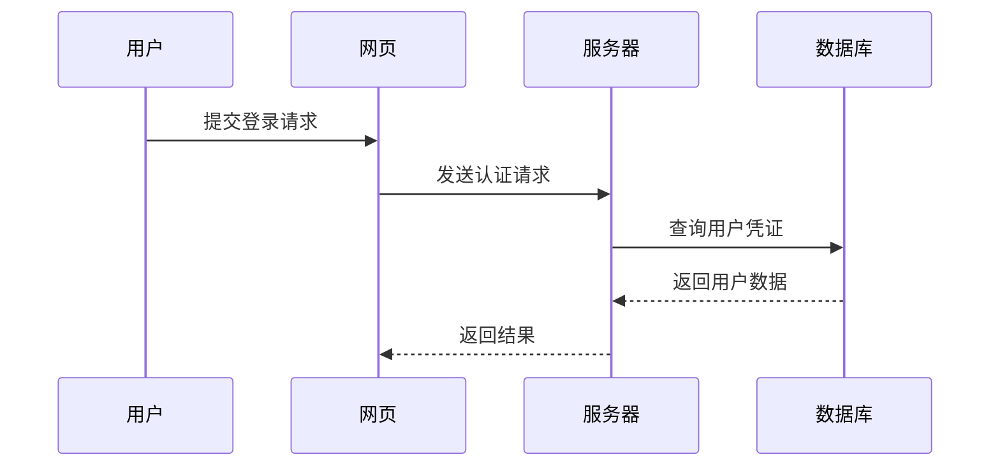
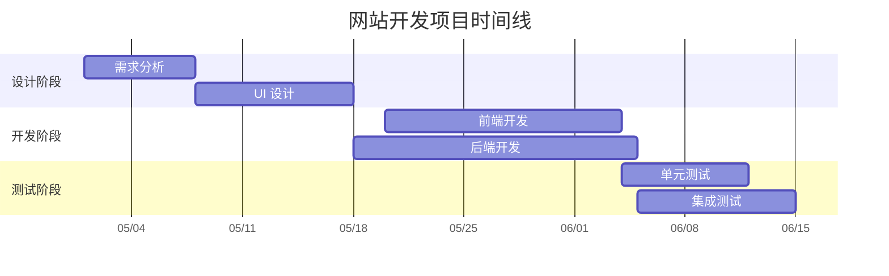
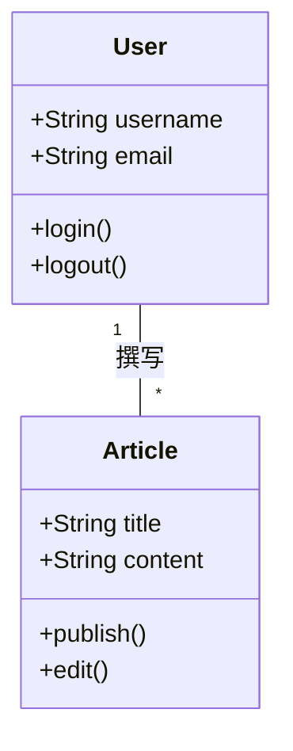
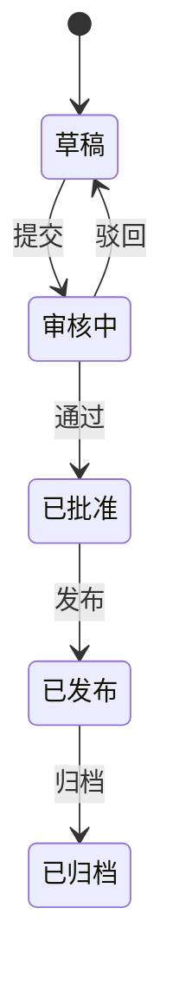
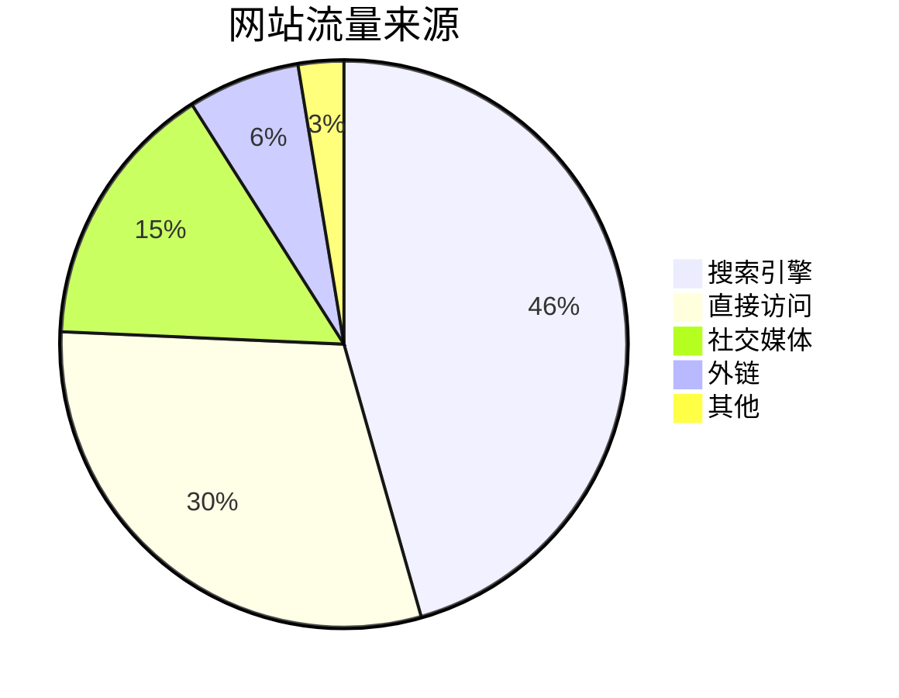
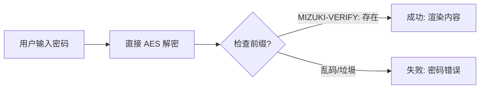

> 本文档整合了 Mizuki 博客模板的所有演示内容，涵盖 Markdown 语法、扩展特性、图表、加密、视频嵌入等各类功能，方便一站式查阅。

---

## 目录

- [一、Markdown 基础语法](#一markdown-基础语法)
- [二、Markdown 扩展功能](#二markdown-扩展功能)
- [三、Mermaid 图表](#三mermaid-图表)
- [四、Mizuki 使用指南](#四mizuki-使用指南)
- [五、文章加密功能](#五文章加密功能)
- [六、嵌入视频](#六嵌入视频)
- [七、草稿功能](#七草稿功能)

---

## 一、Markdown 基础语法

### 段落与换行

HTML Tag: `<p>`

一个或多个空行分隔段落。（空行是指只包含**空格**或**制表符**的行。）

```
这是第一段。
这是同一行（内联）。

这是第二段。
```

#### 换行

HTML Tag: `<br />`

在行尾加**两个或更多空格**。

```
这是第一行。··
这是第二行。
```

### 标题

#### Setext 风格

HTML Tags: `<h1>`, `<h2>`

用**等号（=）**表示 `<h1>`，**连字符（-）**表示 `<h2>`。

```
这是一级标题
=============
这是二级标题
--------------
```

#### atx 风格

HTML Tags: `<h1>` ~ `<h6>`

行首用 1-6 个 **井号（#）**。

```
# 一级标题
## 二级标题
###### 六级标题
```

### 引用

HTML Tag: `<blockquote>`

使用 `>` 符号。

```
> 这是一段引用。
>
> > 这是嵌套引用。
>
> 回到第一层。
```

### 列表

#### 无序列表

HTML Tag: `<ul>`

使用 `*`、`+` 或 `-`。

```
* 红
* 绿
* 蓝
```

#### 有序列表

HTML Tag: `<ol>`

使用数字加点号。

```
1. 第一
2. 第二
3. 第三
```

#### 嵌套列表

```
* A
  * A1
  * A2
* B
```

### 代码块

#### 缩进代码块

缩进 **4 个空格** 或 **1 个制表符**。

```
这是一段普通段落：

    这是一段代码块。
```

#### 围栏代码块

用三个反引号包裹。

```javascript
function test() {
  console.log("Hello World!");
}
```

#### 语法高亮

````
```python
def hello():
    print("Hello World!")
```
````

### 分隔线

HTML Tag: `<hr />`

三个或更多的 `-`、`*` 或 `_`。

```
---
***
___
```

### 表格

HTML Tag: `<table>`

用 `|` 分隔列，用 `-` 分隔表头，用 `:` 控制对齐。

```
| 左对齐 | 居中 | 右对齐 |
|:-------|:----:|-------:|
| aaa    | bbb  | ccc    |
```

### 链接

#### 内联链接

```
[链接文本](http://example.com/ "标题")
```

#### 引用链接

```
[id]: http://example.com/ "标题"
[链接文本][id]
```

### 强调

```
*斜体*
**粗体**
***粗斜体***
```

### 行内代码

使用反引号包裹：`` `printf()` ``

### 图片

```

```

### 删除线

```
~~错误文本。~~
```

### 自动链接

```
<http://example.com/>
<address@example.com>
```

### 反斜杠转义

```
\*文字\*
```

特殊字符前加反斜杠可转义：`` \ ` * _ {} [] () # + - . ! ``

### 内联 HTML

Markdown 中可直接嵌入 HTML。

```html
<table>
  <tr>
    <td>Foo</td>
  </tr>
</table>
```

---

## 二、Markdown 扩展功能

### GitHub 仓库卡片

在页面加载时从 GitHub API 拉取仓库信息。

::github{repo="LyraVoid/Mizuki"}

```
::github{repo="LyraVoid/Mizuki"}
```

### 警告框（Admonitions）

支持的类型：`note` `tip` `important` `warning` `caution`

:::note
用户浏览时应注意的信息。
:::

:::tip
帮助用户更成功的可选信息。
:::

:::important
用户成功所必需的关键信息。
:::

:::warning
因潜在风险需要用户立即关注的紧急内容。
:::

:::caution
某操作的负面潜在后果。
:::

#### 自定义标题

:::note[自定义标题]
这是自定义标题的 note。
:::

```
:::note[自定义标题]
这是自定义标题的 note。
:::
```

#### GitHub 兼容语法

> [!NOTE]
> GitHub 语法同样支持。

```
> [!NOTE]
> GitHub 语法同样支持。
```

### 剧透（Spoiler）

内容 :spoiler[被隐藏了 **嘿嘿**]！

```
内容 :spoiler[被隐藏了 **嘿嘿**]！
```

---

## 三、Mermaid 图表

### 流程图



### 时序图



### 甘特图



### 类图



### 状态图



### 饼图



---

## 四、Mizuki 使用指南

此博客模板基于 [Astro](https://astro.build/) 构建。本文档以外的问题可在 [Astro 文档](https://docs.astro.build/) 中找到答案。

### Front-matter 字段

```yaml
---
title: 我的第一篇博客
published: 2023-09-09
description: 这是我的新 Astro 博客的第一篇文章。
image: ./cover.jpg
tags: [Foo, Bar]
category: 前端
draft: false
---
```

| 字段 | 说明 |
|------|------|
| `title` | 文章标题 |
| `published` | 发布日期 |
| `pinned` | 是否置顶 |
| `priority` | 置顶优先级，数字越小越靠前 |
| `description` | 简短描述，显示在索引页 |
| `image` | 封面图路径（网络 URL、`/public` 路径、相对路径） |
| `tags` | 标签数组 |
| `category` | 分类 |
| `alias` | 自定义别名，可通过 `/posts/{alias}/` 访问 |
| `permalink` | 自定义固定链接，优先级高于 alias |
| `licenseName` | 文章许可名称 |
| `author` | 作者 |
| `sourceLink` | 来源链接 |
| `draft` | 是否为草稿 |
| `encrypted` | 是否加密 |
| `password` | 加密密码 |
| `passwordHint` | 密码提示 |

### 文章存放位置

文章文件应放在 `src/content/posts/` 目录下。可创建子目录来组织文章和资源。

```
src/content/posts/
├── post-1.md
└── post-2/
    ├── cover.webp
    └── index.md
```

### 文章别名

在 front-matter 中设置 `alias` 字段可为文章设置自定义 URL。

```yaml
---
title: 我的特别文章
published: 2024-01-15
alias: "my-special-article"
---
```

设置别名后：
- 可通过 `/posts/my-special-article/` 访问
- 默认 `/posts/{slug}/` URL 仍然有效
- RSS/Atom 订阅将使用别名
- 内部链接自动使用别名

> **注意：** 别名不应包含 `/posts/` 前缀，避免使用特殊字符和空格，使用小写字母和连字符。

---

## 五、文章加密功能

可为文章设置密码保护。

### 启用加密

```yaml
---
title: 私密文章
published: 2024-01-15
encrypted: true
password: "my-secret-password"
passwordHint: "提示：是我家狗的名字"
---
```

### 加密字段

| 字段 | 必填 | 说明 |
|------|------|------|
| `encrypted` | 是 | 设为 `true` 启用密码保护 |
| `password` | 是 | 密码 |
| `passwordHint` | 否 | 密码提示，显示在输入框下方 |

### 解密流程



### 解锁界面

解锁框会显示：
- 主题色的锁图标
- 文章标题"密码保护"
- 要求输入密码的说明
- 密码提示（如有）
- 密码输入框和解锁按钮

输入正确密码后，内容被解密并显示。密码存储在 session storage 中，同一会话内无需重复输入。

---

## 六、嵌入视频

直接从 YouTube、Bilibili 等平台复制嵌入代码，粘贴到 markdown 文件中。

### YouTube

```html
<iframe width="100%" height="468" src="https://www.youtube.com/embed/5gIf0_xpFPI?si=N1WTorLKL0uwLsU_" title="YouTube video player" frameborder="0" allowfullscreen></iframe>
```

<iframe width="100%" height="468" src="https://www.youtube.com/embed/5gIf0_xpFPI?si=N1WTorLKL0uwLsU_" title="YouTube video player" frameborder="0" allow="accelerometer; autoplay; clipboard-write; encrypted-media; gyroscope; picture-in-picture; web-share" allowfullscreen></iframe>

### Bilibili

```html
<iframe width="100%" height="468" src="//player.bilibili.com/player.html?bvid=BV1fK4y1s7Qf&p=1&autoplay=0" scrolling="no" border="0" frameborder="no" framespacing="0" allowfullscreen="true"></iframe>
```

<iframe width="100%" height="468" src="//player.bilibili.com/player.html?bvid=BV1fK4y1s7Qf&p=1&autoplay=0" scrolling="no" border="0" frameborder="no" framespacing="0" allowfullscreen="true"></iframe>

---

## 七、草稿功能

将文章 front-matter 中的 `draft` 字段设置为 `true`，文章将不会对普通访客可见。

```yaml
---
title: 草稿示例
published: 2024-01-11
tags: [Markdown, Blogging, Demo]
category: Examples
draft: true
---
```

发布时只需将 `draft` 改为 `false`：

```yaml
---
title: 草稿示例
published: 2024-01-11
tags: [Markdown, Blogging, Demo]
category: Examples
draft: false
---
```
